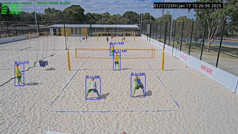

# HPE_volleyball

This project combines object detection, multi-object tracking, and pose estimation to analyze volleyball training sessions. It uses a customized version of [ByteTrack](https://github.com/ifzhang/ByteTrack) and RTMPose (through RTMlib) for tracking and pose analysis of players during spiking actions.

👉 You can download pre-trained RTMDet and RTMPose ONNX models from:
https://platform.openmmlab.com/deploee

## 🎥 Demo

[](assets/demo.mp4)

> 📽️ Click the image to watch the full demo (1080p MP4)

## 📁 Project Structure

```
HPE_volleyball/
├── ByteTrack/           # Forked + modified ByteTrack repo (tracking)
├── models/              # RTMPose model weights, ONNX files, etc.
├── data/                # Input videos for processing
├── output/
│   ├── h5/              # HDF5 outputs: poses, IDs, bboxes, scores
│   └── video/           # Output videos with overlays
├── scripts/             # Custom scripts (main pipeline, helpers)
├── paths.py             # Project-relative path definitions
└── requirements.txt     # Python dependencies
```

## 🔧 Prerequisites

To run inference on GPU, make sure the following are properly installed:

- **CUDA Toolkit** (e.g. CUDA 11.8 or compatible with your PyTorch version)
- **cuDNN** (compatible with your CUDA version)

## ⚙️ Setup

1. **Clone this repo**
   ```bash
   git clone https://github.com/yourusername/HPE_volleyball.git
   cd HPE_volleyball
   ```

2. **Set up environment**
   ```bash
   pip install -r requirements.txt
   ```

3. **Install ByteTrack**
   ```bash
   cd ByteTrack
   pip install -e .
   cd ..
   ```

4. (Optional) Ensure output folders are created:
   ```python
   from scripts.paths import ensure_output_dirs
   ensure_output_dirs()
   ```

## 🚀 Running the Pipeline

Work in progress — main script(s) will be located in `scripts/`.

## 📦 Dependencies

All Python packages are listed in `requirements.txt`.

GPU inference requires a working CUDA installation compatible with your PyTorch/ONNX versions

## 📄 Notes

- ByteTrack has been modified (e.g. fixed deprecated NumPy types).
- All paths are defined relative to the project root via `paths.py`.

## ✏️ Author

Francois Fraysse — [frayssfe@gmail.com]

Thanks and credits to:  
- MMPose project - [https://github.com/open-mmlab/mmpose]  
- RTMlib - [https://github.com/Tau-J/rtmlib]  
- ByteTrack - [https://github.com/ifzhang/ByteTrack]
